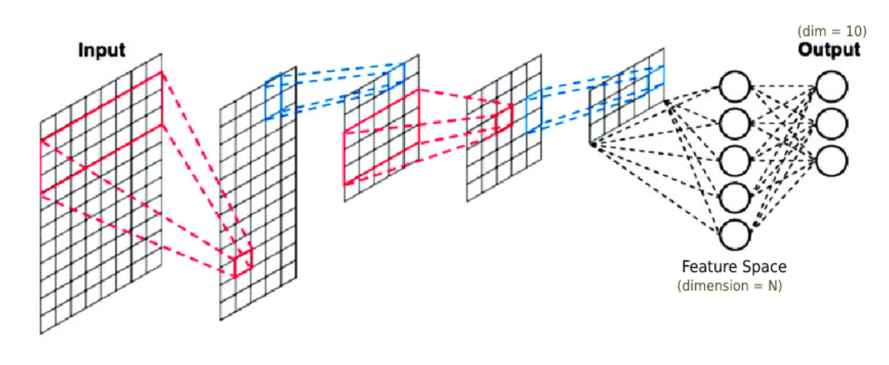
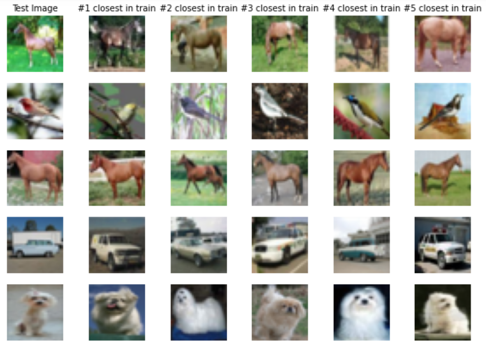
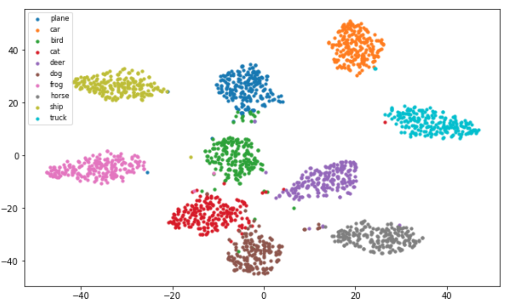

# Implement ResNet-18 from scratch with PyTorch and train on CIFAR10.

## Prerequisites
- Python 3.6+
- PyTorch
- Scikit-learn

## Accuracy
| Model             | Acc.        |
| ----------------- | ----------- |
| [ResNet18](https://arxiv.org/abs/1512.03385)          | 90.71%      |

## Exploring Feature Space
explore and visualize feature space -ouputs of neurons of the one left to last layer- using **t-SNE** and **k-nearest neighbors** algortihms.

### feature space definition
<h3 align="center">
  
</h3>

### k-nearest neighbors
<h3 align="center">
  
</h3>

### t-SNE
<h3 align="center">
  
</h3>
